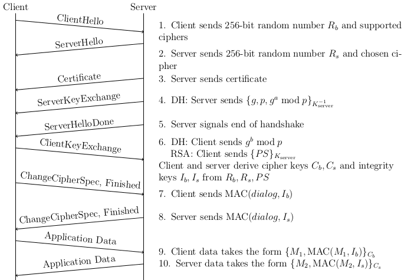

I'm a teaching assistant for Berkeley's undergrad computer security course, and I was given the assignment to prepare a week of section material for the class. This section would be on the details of TLS. After rigorous searching, I was unable to find any diagrams accurately describing the TLS handshake. The diagram didn't need to be perfect, and it certainly didn't need to describe every possibility of error during the handshake. But it should at least be accurate. The best diagram I could find omitted "mod p" from the Diffie-Hellman parameters, said the client and server sent hashes instead of MACs, and didn't describe the separate encryption and integrity keys that were derived from the premaster secret.  

So, I decided to make my own diagram. Forgive my crude LaTeX, but the diagram does its job.
<object data="../public/tls-diagram.pdf" type="application/pdf" width="100%" height="550px">
    <embed src="../public/tls-diagram.pdf">
    </img>
    </embed>
</object>

You can get the LaTeX source here: [tls-diagram.tex](../public/tls-diagram.tex)
